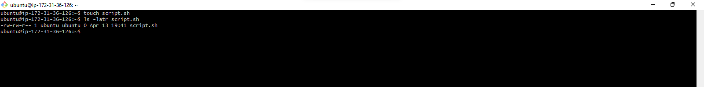
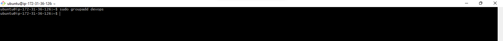
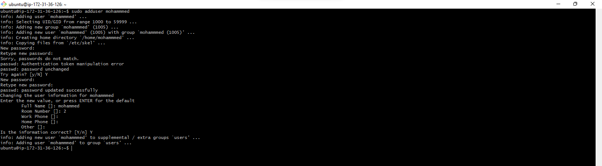
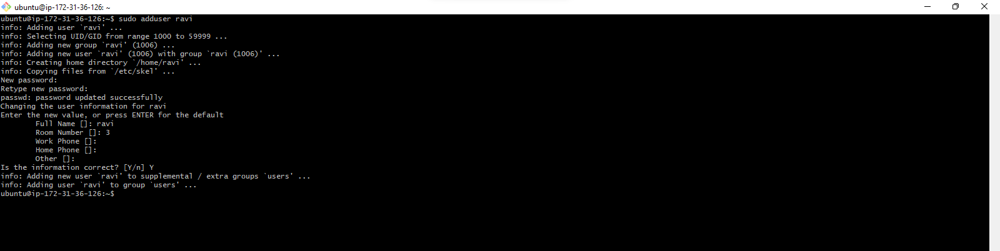
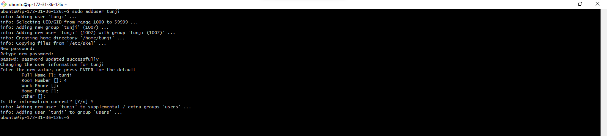
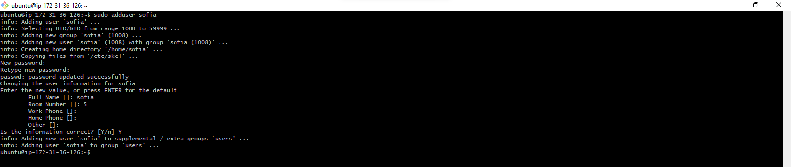
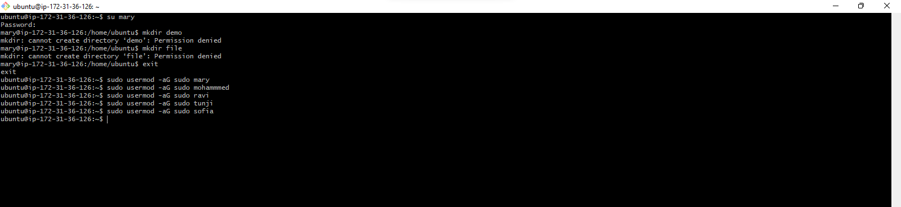
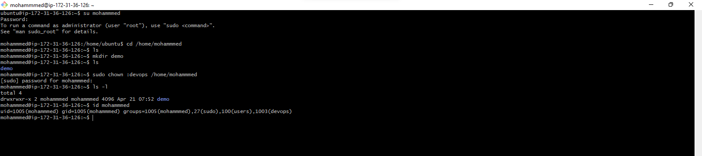
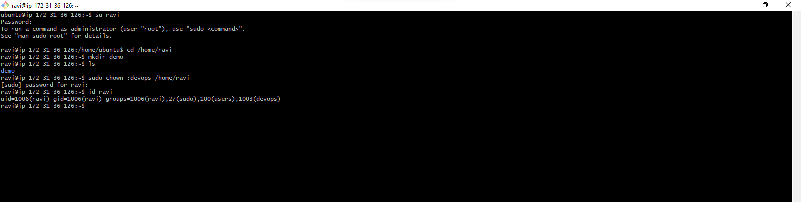
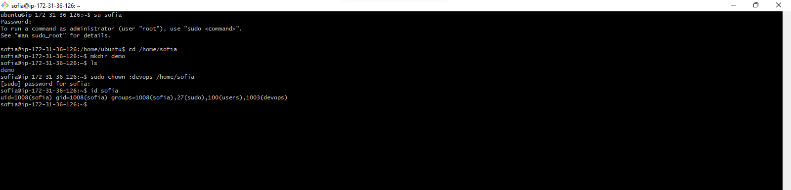

# Linux Administration Capstone Project

## Advanced Linux Commands

It is essential to understand how to manage file permissions and ownership in Linux. This knowledge empowers you to control access to files and directories, ensuring the security and integrity of your system. In this project, we explore some important commands and concepts related to file permissions and ownership. 

## Numeric Representation of Permissions

In Linux, permissions are represented using numeric values. Each file permission is assigned a numeric value:

* **_no permissions = 0_**
* **_execute = 1_**
* **_write = 2_**
* **_read = 4_**

These values are combined to represent the permissions for each user class. Lets consider a few examples. 

**Permissions Represented by 7**

* 4(read) + 2(write) + 1(execute) = 7
* Symbolic representation : rwx
* Means : Read, write, and execute are all granted

**Permissions Represented by 5**

* 4(read) + 1(execute) = 5
* Symbolic representation: r-x
* Means : Only read and execute permissions are granted.

**Permissions Represented by 6**

* 4(read) + 2(write) = 6
* Symbolic representation: rw-
* Means: Read and write permissions are granted

## Shorthand Representation of Permissions

In Linux, you can represent file permissions using a shorthand method.

**Understanding User Classes from Permissions Perspective**

There are categories of users that Linux recognizes when deciding who can do what with a file. This concept is known as User Classes in Linux and there are three main classes:

* Owner: The person who created the file. Often referred to as "users".
* Group: A collection of users who share certain permissions for the file.
* Others: Anyone else who has acess to the computer but doesn't belong to the first two categories.

When discussing permissions, you might notice hyphens(-) being mentioned. In this context of Linux file permissions, a hyphen doesn't necessarily represent a user class. Instead, it is used to show the absence of a permission.

We can see this by running the `ls -latr` command on your terminal

## Side Tasks

**Task 1**: Create a group on the server and name it 'devops'

Do this by running the `sudo groupadd devops` command

  
**Task 2**: Create 5 users ["mary", "mohammed", "ravi", "tunji", "sofia"] and ensure each user belong to the devops group.

Create the 5 users by running the following commands:
    
`sudo adduser mary`

!add mary

`sudo adduser mohammed`

`sudo adduser ravi`

`sudo adduser tunji`

`sudo adduser sofia`

Ensure they belong to the 'devops' group by running the following commands:

`sudo usermod -aG devops mary`

`sudo usermod -aG devops mohammed`

`sudo usermod -aG devops ravi`

`sudo usermod -aG devops tunji`

`sudo usermod -aG devops sofia`

**Task 3** :  Create a folder for each user in the `/home` directory.

You can do this by switching to the particular user then creating a folder by running the following commands:

1. `su mary` - Logs the user in
   
   `su mohammed`
   
   `su ravi`
   
   `su tunji`
   
   `su sofia`
   

3. `cd /home/mary` - Changes to the /home/mary directory

   `cd /home/mohammed`

   `cd /home/ravi`

   `cd /home/tunji`

   `cd /home/sofia`

4. `mkdir demo` - Creates a folder in the /home/mary directory

   
   
   
   
   
   
   
   
   

**Task 4** : Ensure that the group ownership of each created folder belongs to the devops group

Run the following commands:

`sudo chown :devops /home/mary/demo`

`sudo chown :devops /home/mohammed/demo`

`sudo chown :devops /home/ravi/demo`

`sudo chown :devops /home/tunji/demo`

`sudo chown :devops /home/sofia/demo`
   
    
